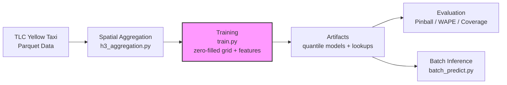

# NYC Yellow Taxi Demand Forecasting

> Spatial-temporal demand forecasting system for NYC yellow taxi data using H3 geospatial indexing and LightGBM quantile regression. Predicts 15-minute demand intervals with uncertainty bounds across NYC's hexagonal grid cells.

[](https://www.python.org/downloads/)
[](https://opensource.org/licenses/MIT)

---

## What It Does

NYC taxi demand fluctuates dramatically across space and time—surge pricing, events, weather, and transit disruptions create localized spikes that traditional city-wide averages miss. This system aggregates TLC yellow taxi trip records into a zero-filled H3 hexagonal demand grid at 15-minute granularity, engineers strictly backward-looking temporal features, and trains quantile LightGBM models to produce probabilistic forecasts evaluated against naive baselines on a strict out-of-time holdout.

| Capability | Component | Example Output |
|------------|-----------|----------------|
| Data download | `download_tlc_2025_yellow.py` | TLC 2025 parquet files |
| Spatial aggregation | `h3_aggregation.py` | Trip counts per H3 cell, 15-min buckets |
| Quantile forecasting | `train.py` | q10, q50, q90 demand predictions per cell |
| Probabilistic evaluation | `evaluate_model.py` | Verdict table vs baselines, pinball loss, WAPE, coverage |
| Batch inference | `batch_predict.py` | q10/q50/q90 + conf_width per cell-slot |

---

## Architecture




**Pipeline stages:**

1. **Ingestion** — Downloads NYC TLC yellow taxi Parquet files
2. **Spatial Aggregation** — Localizes pickup timestamps to `America/New_York` (DST-safe flooring), maps taxi zones to H3 resolution-8 cells, logs and drops unmapped zone IDs (264/265), and aggregates to 15-min demand counts
3. **Training** — Builds a dense zero-filled (slot × cell) grid, engineers lag/rolling/calendar features plus train-only lookup features, splits data chronologically 80/10/10, and drops vendor timestamp outliers outside the dominant year
4. **Modeling** — Trains one LightGBM quantile regressor per alpha (0.1, 0.5, 0.9) with early stopping on the calibration window and a fixed seed; per-row quantile rearrangement + zero clip guarantees `q10 ≤ q50 ≤ q90`
5. **Evaluation** — Computes pinball loss, WAPE vs four baselines, prediction interval coverage, conditional coverage, and reliability calibration on the holdout
6. **Serving** — Batch inference loads versioned artifacts and returns quantile predictions with non-negative confidence width

---

## Key Features

### 1. H3 Geospatial Indexing

Demand is aggregated at **H3 resolution 8** (~0.74 km² hexagons) rather than raw taxi-zone counts, enabling consistent cell-level comparison across the city.

- **Spatial module:** `src/spatial/h3_aggregation.py` maps pickups → H3 cell IDs
- **Taxi zone lookup:** `src/spatial/taxi_zone_lookup.py` maps TLC zones to H3 via projected centroids
- **Data-quality logging:** Unmapped `PULocationID`s and invalid timestamps are counted and reported, never silently discarded

### 2. Quantile Regression with LightGBM

Instead of point estimates, the model predicts full distributions:

| Quantile | Interpretation | Use Case |
|----------|----------------|----------|
| **q10** | 10th percentile | Conservative staffing (low-traffic scenario) |
| **q50** | Median | Baseline planning |
| **q90** | 90th percentile | Surge capacity / fleet allocation |

**Training details:**
- Chronological 80/10/10 split (train / calibration / test — test strictly post-dates training)
- Early stopping (50 rounds) on the calibration window
- Quantile objective with `alpha` per model, fixed seed, deterministic mode
- Per-row quantile rearrangement with zero clipping (`sort` → `clip`) — no quantile crossing, `conf_width ≥ 0` guaranteed
- Models saved as `{0.1: model, 0.5: model, 0.9: model}` with train-derived lookup tables

### 3. Rich Temporal Feature Engineering

```python
# Lag features (on the zero-filled grid — true time shifts)
demand_t-15m, demand_t-1h, demand_t-4h, demand_t-168h   # same cell, past intervals

# Rolling statistics
demand_roll_mean_3h, demand_roll_var_3h    # smoothed recent trend
demand_roll_mean_6h, demand_roll_var_6h

# Cyclical encodings
hour_sin, hour_cos                         # 24-hour cycle
dow_sin, dow_cos                           # 7-day week cycle

# Calendar
is_holiday, is_weekend                     # US federal holidays

# Cell identity (train-window-only lookups)
cell_mean, cell_dowhour_mean               # per-cell demand history
```

### 4. Probabilistic Evaluation

The evaluation script (`scripts/evaluate_model.py`) reports, on the holdout only:

- **Verdict Table** — model vs four naive baselines on the identical test window
- **Pinball Loss** — Proper scoring rule for quantile forecasts
- **WAPE** — Weighted Absolute Percentage Error (handles zero-demand cells)
- **Prediction Interval Coverage** — % of true values falling inside q10-q90 band, plus conditional coverage by demand bucket
- **Reliability Diagram** — Calibration check: predicted quantile vs. empirical fraction
- **Per-cell WAPE** — Identifies worst-performing H3 cells for targeted retraining

### 5. Batch Inference

Batch scoring service (`scripts/batch_predict.py`) with:

- **Feature consistency** — Rebuilds the identical feature grid used in training from saved lookup artifacts
- **Quantile output** — Returns `q10`, `q50`, `q90`, and `conf_width` per cell-slot, with crossing-free non-negative intervals
- **Model versioning** — Loads models, lookups, and `train_meta.json` from `artifacts/models/`

---

## Quick Start

### Local Setup

```bash
# 1. Clone
git clone https://github.com/Ajay-Kumar64/Demand_Forecasting.git
cd Demand_Forecasting

# 2. Environment
python -m venv venv
source venv/bin/activate  # Windows: venv\Scripts\activate
pip install -r requirements.txt

# 3. Download TLC data
python -m src.ingestion.download_tlc_2025_yellow

# 4. Build H3 demand aggregates
python -m scripts.build_h3_demand

# 5. Validate aggregates
python -m scripts.validate_h3_demand --path data/feature_store/h3_demand_2025.parquet --h3-res 8

# 6. Train quantile models
python -m src.modeling.train --demand-parquet data/feature_store/h3_demand_2025.parquet

# 7. Evaluate
python -m scripts.evaluate_model --demand-parquet data/feature_store/h3_demand_2025.parquet

# 8. Run batch inference
python -m scripts.batch_predict --demand-parquet data/feature_store/h3_demand_2025.parquet \
    --start 2025-11-24T00:00 --end 2025-11-25T00:00
```

### Batch Inference Usage

```bash
python -m scripts.batch_predict \
  --demand-parquet data/feature_store/h3_demand_2025.parquet \
  --models-dir artifacts/models \
  --start 2025-11-24T00:00 --end 2025-11-25T00:00 \
  --output artifacts/predictions/predictions.parquet
```

**Response:**

```json
[
  {
    "h3_cell": "852a1003fffffff",
    "ts_15min": "2025-11-24T08:00:00",
    "q10": 8.2,
    "q50": 14.5,
    "q90": 22.1,
    "conf_width": 13.9
  }
]
```

---

## Project Structure

```
demand_forecasting/
├── scripts/
│   ├── build_h3_demand.py       # Aggregate raw trips → H3 15-min counts
│   ├── batch_predict.py         # Batch inference from versioned artifacts
│   ├── evaluate_model.py        # Holdout eval: baselines, WAPE, coverage, calibration
│   ├── smoke_test_one_day.py    # Validation smoke test for single day
│   └── validate_h3_demand.py    # Data quality checks on H3 aggregates
├── src/
│   ├── ingestion/
│   │   └── download_tlc_2025_yellow.py # TLC data downloader
│   ├── modeling/
│   │   └── train.py             # Zero-filled grid, features, split, LightGBM quantile training
│   ├── spatial/
│   │   ├── h3_aggregation.py    # DST-safe timestamps, zone → H3 aggregation
│   │   └── taxi_zone_lookup.py  # Zone ID ↔ H3 mapping
│   └── validation/
│       └── h3_demand_validator.py # Schema & distribution checks
├── artifacts/models/             # (gitignored) Models, lookups, train_meta.json
├── requirements.txt
└── README.md
```

---

## Tech Stack

| Layer | Technology |
|-------|------------|
| **Language** | Python 3.10+ |
| **ML Framework** | LightGBM (quantile regression) |
| **Geospatial** | H3-py, GeoPandas, Shapely |
| **Data Processing** | Pandas, NumPy, PyArrow |
| **Evaluation** | Matplotlib |
| **Validation** | `h3_demand_validator.py` (schema, nulls, resolution, values) |

---

## Evaluation Metrics

| Metric | Result (Holdout) | Description |
|--------|------------------|-------------|
| **WAPE (q50)** | 22.49% vs 26.46% best naive | Volume-weighted error; beats all baselines |
| **Pinball Loss (q10/q50/q90)** | 0.274 / 0.687 / 0.364 | Per-quantile loss on holdout |
| **Coverage (q10-q90)** | 89.6% (nominal 80%) | Conservative intervals for capacity planning |
| **Calibration** | Near diagonal | Reliability diagram on holdout |

---

## Known Limitations

1. **Zone-centroid mapping.** Trips map to H3 via taxi-zone centroids, not raw pickup coordinates—intra-zone spatial detail is compressed.
2. **No automated retraining.** Models are static pickles; no drift detection or scheduled retraining pipeline.
3. **Single-city scope.** H3 resolution and holiday calendar are NYC-specific. Generalizing to other cities requires feature module changes.
4. **Batch inference only.** No real-time endpoint; low-latency serving requires shipping lookup tables and server-side feature computation.
5. **No exogenous covariates.** Weather, events, and flight schedules are absent—worst-WAPE cells are high-volume hubs with event-driven demand.

---

## Roadmap

- [ ] Add automated retraining pipeline (Airflow/Prefect)
- [ ] Implement model drift detection (PSI, KS-test on features)
- [ ] Add weather and flight-schedule covariates
- [ ] Per-period conformal calibration for coverage
- [ ] Dockerize batch runner for containerized deployment
- [ ] Add Grafana dashboard for prediction monitoring

---

## License

MIT License — see [LICENSE](LICENSE) for details.
