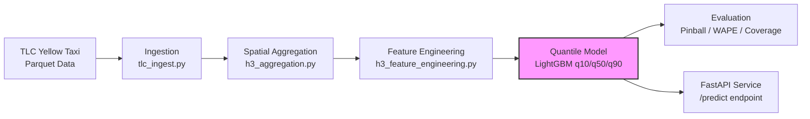

# NYC Yellow Taxi Demand Forecasting

> Spatial-temporal demand forecasting system for NYC yellow taxi data using H3 geospatial indexing and LightGBM quantile regression. Predicts 15-minute demand intervals with uncertainty bounds across Manhattan's hexagonal grid cells.

[](https://www.python.org/downloads/)
[](https://opensource.org/licenses/MIT)

---

## What It Does

NYC taxi demand fluctuates dramatically across space and time—surge pricing, events, weather, and transit disruptions create localized spikes that traditional city-wide averages miss. This system aggregates TLC yellow taxi trip records into H3 hexagonal cells at 15-minute granularity, engineers temporal and spatial features, and trains quantile LightGBM models to produce probabilistic forecasts with calibrated prediction intervals.

| Capability | Component | Example Output |
|------------|-----------|----------------|
| Spatial aggregation | `h3_aggregation.py` | Trip counts per H3 cell, 15-min buckets |
| Temporal features | `h3_feature_engineering.py` | Lag-1h, lag-24h, rolling 3h mean, cyclical hour encodings |
| Quantile forecasting | `model_training.py` | q10, q50, q90 demand predictions per cell |
| Probabilistic evaluation | `evaluate_model.py` | Pinball loss, WAPE, coverage, calibration plots |
| Production inference | `api/main.py` | FastAPI endpoint returning q10/q50/q90 + confidence width |

---

## Architecture



**Pipeline stages:**

1. **Ingestion** — Downloads NYC TLC yellow taxi Parquet files and normalizes columns
2. **Spatial Aggregation** — Maps pickup coordinates to H3 resolution-8 cells; aggregates to 15-min demand counts
3. **Feature Engineering** — Adds lag features (1h, 4h, 168h), rolling statistics (3h, 6h), cyclical time encodings (hour, day-of-week), and US federal holiday flags
4. **Modeling** — Trains separate LightGBM quantile regressors (alpha=0.1, 0.5, 0.9) with 5-fold time-series cross-validation
5. **Evaluation** — Computes pinball loss, WAPE, prediction interval coverage, and reliability calibration
6. **Serving** — FastAPI endpoint loads pickled models and returns quantile predictions with confidence width

---

## Key Features

### 1. H3 Geospatial Indexing

Demand is aggregated at **H3 resolution 8** (~0.74 km² hexagons) rather than coarse taxi zones. This captures micro-local patterns—Times Square vs. Chelsea vs. Financial District—within the same borough.

- **Spatial module:** `src/spatial/h3_aggregation.py` converts lat/lon → H3 cell IDs
- **Taxi zone lookup:** `src/spatial/taxi_zone_lookup.py` maps TLC zones to H3 for validation

### 2. Quantile Regression with LightGBM

Instead of point estimates, the model predicts full distributions:

| Quantile | Interpretation | Use Case |
|----------|----------------|----------|
| **q10** | 10th percentile | Conservative staffing (low-traffic scenario) |
| **q50** | Median | Baseline planning |
| **q90** | 90th percentile | Surge capacity / fleet allocation |

**Training details:**
- 5-fold TimeSeriesSplit (preserves temporal order)
- Early stopping (50 rounds) per fold
- Quantile objective with `alpha` per model
- Models saved as `{0.1: [fold1, ..., fold5], 0.5: [...], 0.9: [...]}`

### 3. Rich Temporal Feature Engineering

```python
# Lag features
demand_t-1h, demand_t-4h, demand_t-168h   # same cell, past intervals

# Rolling statistics
demand_roll_mean_3h, demand_roll_var_3h    # smoothed recent trend
demand_roll_mean_6h, demand_roll_var_6h

# Cyclical encodings
hour_sin, hour_cos                         # 24-hour cycle
dow_sin, dow_cos                           # 7-day week cycle

# Calendar
is_holiday, is_weekend                     # US federal holidays
```

### 4. Probabilistic Evaluation

The evaluation script (`scripts/evaluate_model.py`) reports:

- **Pinball Loss** — Proper scoring rule for quantile forecasts
- **WAPE** — Weighted Absolute Percentage Error (handles zero-demand cells)
- **Prediction Interval Coverage** — % of true values falling inside q10-q90 band
- **Reliability Diagram** — Calibration check: predicted quantile vs. empirical fraction
- **Per-cell WAPE** — Identifies worst-performing H3 cells for targeted retraining

### 5. Production-Ready API

FastAPI service (`api/main.py`) with:

- **Auto feature alignment** — Handles missing columns by zero-filling to match training schema
- **Quantile output** — Returns `q10`, `q50`, `q90`, and `conf_width` per prediction
- **Model versioning** — Loads `artifacts/models/lgbm_quantile_models.pkl` at startup

---

## Quick Start

### Local Setup

```bash
# 1. Clone
git clone https://github.com/Ajay-Kumar64/Demand_Forecasting.git
cd Demand_Forecasting

# 2. Environment
python -m venv venv
source venv/bin/activate  # Windows: venv\Scripts\activate
pip install -r requirements.txt

# 3. Ingest TLC data
python scripts/run_ingestion.py

# 4. Build H3 demand aggregates
python scripts/build_h3_demand.py

# 5. Engineer features
python scripts/build_h3_features.py

# 6. Train quantile models (or use Google Colab: src/modeling/model_training.py)
python src/modeling/model_training.py

# 7. Evaluate
python scripts/evaluate_model.py

# 8. Start API
uvicorn api.main:app --host 0.0.0.0 --port 8000
```

### API Usage

```bash
curl -X POST "http://localhost:8000/predict" \
  -H "Content-Type: application/json" \
  -d '{
    "features": [
      {
        "h3_cell": "852a1003fffffff",
        "ts_15min": "2025-01-15T08:00:00",
        "demand_t-1h": 12.5,
        "demand_t-4h": 8.0,
        "hour_sin": 0.5,
        "hour_cos": 0.866,
        "is_holiday": 0
      }
    ]
  }'
```

**Response:**

```json
[
  {
    "h3_cell": "852a1003fffffff",
    "ts_15min": "2025-01-15T08:00:00",
    "q10": 8.2,
    "q50": 14.5,
    "q90": 22.1,
    "conf_width": 13.9
  }
]
```

---

## Project Structure

```
demand_forecasting/
├── api/
│   ├── main.py                  # FastAPI prediction service
│   ├── model_loader.py          # Pickled quantile model loader
│   └── predict.py               # Prediction logic (q10/q50/q90 + conf_width)
├── scripts/
│   ├── build_h3_demand.py       # Aggregate raw trips → H3 15-min counts
│   ├── build_h3_features.py     # Run full feature engineering pipeline
│   ├── evaluate_model.py        # Pinball loss, WAPE, coverage, calibration
│   ├── run_ingestion.py         # Download & normalize TLC parquet files
│   ├── smoke_test_one_day.py    # Validation smoke test for single day
│   └── validate_h3_demand.py    # Data quality checks on H3 aggregates
├── src/
│   ├── features/
│   │   └── h3_feature_engineering.py   # Lags, rolling stats, cyclical time, holidays
│   ├── ingestion/
│   │   ├── download_tlc_2025_yellow.py # TLC data downloader
│   │   └── tlc_ingest.py               # Parquet normalization
│   ├── modeling/
│   │   └── model_training.py           # LightGBM quantile training (Colab-ready)
│   ├── spatial/
│   │   ├── h3_aggregation.py           # Lat/lon → H3 cell aggregation
│   │   └── taxi_zone_lookup.py         # Zone ID ↔ H3 mapping
│   └── validation/
│       └── h3_demand_validator.py      # Schema & distribution checks
├── requirements.txt
└── README.md
```

---

## Tech Stack

| Layer | Technology |
|-------|------------|
| **Language** | Python 3.10+ |
| **ML Framework** | LightGBM (quantile regression) |
| **Geospatial** | H3-py, GeoPandas, Shapely |
| **Data Processing** | Pandas, NumPy, PyArrow |
| **API** | FastAPI, Uvicorn |
| **Validation** | Great Expectations (via `h3_demand_validator.py`) |
| **Hyperparameter Tuning** | Optuna (optional) |
| **Explainability** | SHAP (optional) |
| **Config** | PyYAML |

---

## Evaluation Metrics

| Metric | Target | Description |
|--------|--------|-------------|
| **WAPE** | < 25% | Weighted absolute percentage error |
| **Pinball Loss (q50)** | < 5.0 | Median quantile loss |
| **Coverage (q10-q90)** | ~80% | % of true values inside interval |
| **Calibration** | Near diagonal | Reliability diagram slope ≈ 1 |

---

## Known Limitations

1. **Colab-dependent training.** `model_training.py` hardcodes Google Drive paths (`/content/drive/...`). Local training requires path modifications.
2. **No automated retraining.** Models are static pickles; no drift detection or scheduled retraining pipeline.
3. **Single-city scope.** H3 resolution and holiday calendar are NYC-specific. Generalizing to other cities requires feature module changes.
4. **No real-time ingestion.** Current pipeline processes historical parquet batches; streaming ingestion (Kafka/Kinesis) not implemented.
5. **Model artifact size.** 5-fold quantile models produce large pickle files; consider ONNX or joblib compression for production.

---

## Roadmap

- [ ] Add automated retraining pipeline (Airflow/Prefect)
- [ ] Implement model drift detection (PSI, KS-test on features)
- [ ] Add weather API as external covariate
- [ ] Export to ONNX for faster inference
- [ ] Dockerize API for containerized deployment
- [ ] Add Grafana dashboard for prediction monitoring

---

## License

MIT License — see [LICENSE](LICENSE) for details.
